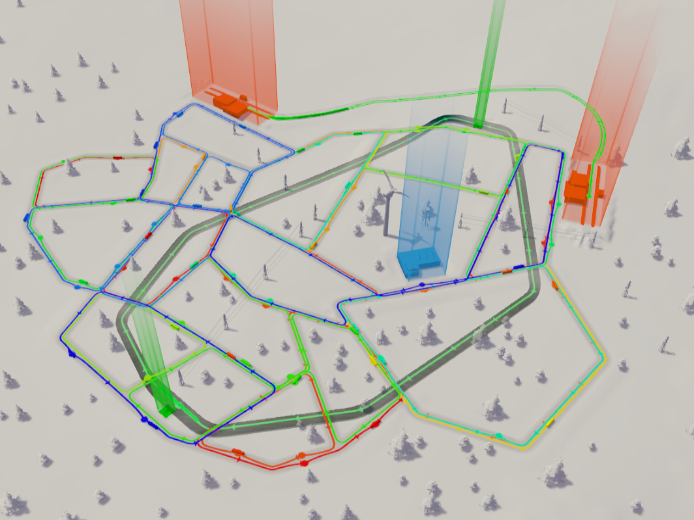

Transport Line Color Mod
=================================

Assign random color to all created transport lines.

Default colors




Custom colors
-------------

I have used [Distinct Colors Generator](http://phrogz.net/css/distinct-colors.html) to create default color set, but if you are not happy with it feel feel to create your own. 

TransportLineColorMod will check ```colors.txt``` file in ```%USERPROFILE%\AppData\Local\Colossal Order\Cities_Skylines\Addons\Mods\TransportLineColorMod``` directory and use its content as source for random colors. If custom color file doesn't exist default colors will be used.

Example ```colors.txt``` file

	#d40000, #bed400, #00d42a, #0094d4, #5500d4, #d4006a

	

